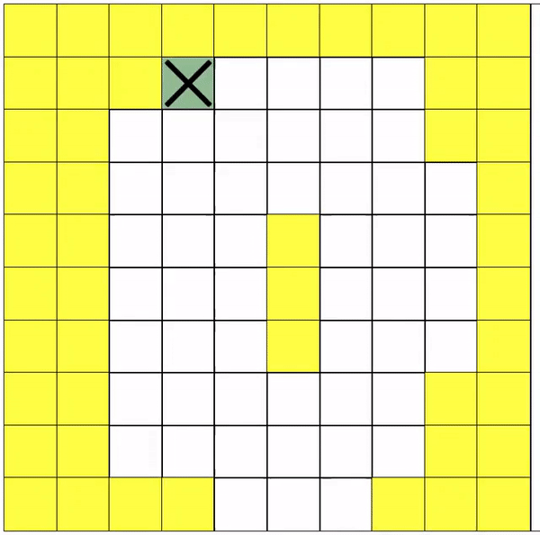

**My Playground for RL algorithms** 

Implemented algorithms:
 * REINFORCE with baseline
    * [pyTorch documentation implementation](algs/reinforce/reference/reinforce_pytorch_docu.py)
    * [my implementation](algs/reinforce/reinforce.py)
 * DQN
    * [stable-baseline3 with my custom environment](algs/dqn/reference/dqn_stable-baselines3.py)
    * [my implementation](algs/dqn/dqn.py) 
 
 
These algorithms are run on CartPole and [my own coloring environment](common/env.py)
Performance of my algorithm is compared to that of [stable-baselines3](https://github.com/DLR-RM/stable-baselines3) in 
order to ensure correctness 
```bash
clone git@github.com:denisergashbaev/rl_playground.git
cd rl_playground
python3 --version # should be 3.6.* something
python3 -m venv venv
source venv/bin/activate
pip install --upgrade pip # we need new version of pip for requirements.txt
pip install -r requirements.txt
```

Example script running a `DQN` algorithm on the `ColoringEnv`: 
```
python rl_playground/algs/dqn/dqn_main_simple.py --size=10x10 --log_every=1 --start_train_ts=100 --gamma=1.0 --seed=1 --learning_rate=1e-4 --max_grad_norm=10 --step_reward=1 --depth_channel_first --stay_inside --with_step_penalty --with_revisit_penalty --with_color_reward
```

**Result** (javascript-based rendering not yet in the repo)

[](out/optimal_solution.gif)
